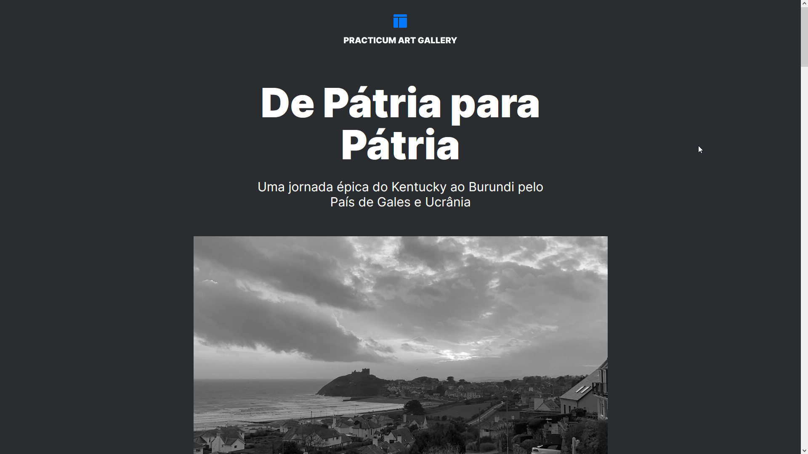

# From Homeland to Homeland

  

## About

A single page application to show the hometowns of some TripleTen's employees

This was a project made for TripleTen's online web development bootcamp.
It was used as a way to practice the creation of responsive websites and the usage of the BEM metodology.

The website is in brazillian portuguese!

### Click [here](https://anynoise00.github.io/from-homeland-to-homeland/) to visit the website.

## Mobile layout

 

## Technologies

The following tools where used for building this project:

- HTML, CSS & JavaScript
- BEM methodology

## Credits

This projects uses [TripleTen](https://tripleten.com/)'s figma template  

